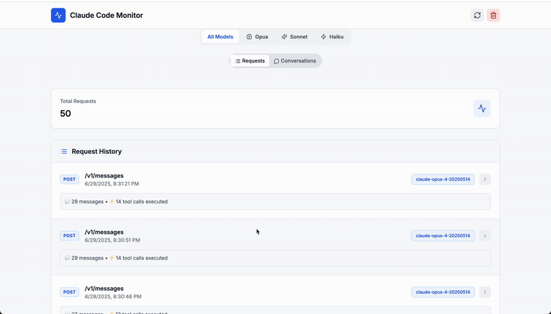

# Claude Code Proxy



A transparent proxy for capturing and visualizing in-flight Claude Code requests and conversations, with optional agent routing to different LLM providers.

## What It Does

Claude Code Proxy serves three main purposes:

1. **Claude Code Proxy**: Intercepts and monitors requests from Claude Code (claude.ai/code) to the Anthropic API, allowing you to see what Claude Code is doing in real-time
2. **Conversation Viewer**: Displays and analyzes your Claude API conversations with a beautiful web interface
3. **Agent Routing (Optional)**: Routes specific Claude Code agents to different LLM providers (e.g., route code-reviewer agent to GPT-4o)

## Features

- **Transparent Proxy**: Routes Claude Code requests through the monitor without disruption
- **Agent Routing (Optional)**: Map specific Claude Code agents to different LLM models
- **Request Monitoring**: SQLite-based logging of all API interactions
- **Live Dashboard**: Real-time visualization of requests and responses
- **Conversation Analysis**: View full conversation threads with tool usage
- **Easy Setup**: One-command startup for both services

## Quick Start

### Prerequisites
- Go 1.20+
- Node.js 18+
- Claude Code

### Installation

1. **Clone the repository**
   ```bash
   git clone https://github.com/seifghazi/claude-code-proxy.git
   cd claude-code-proxy
   ```

2. **Configure the proxy**
   ```bash
   cp config.yaml.example config.yaml
   ```

3. **Install and run** (first time)
   ```bash
   make install  # Install all dependencies
   make dev      # Start both services
   ```

4. **Subsequent runs** (after initial setup)
   ```bash
   make dev
   # or
   ./run.sh
   ```

5. **Using with Claude Code**

To use this proxy with Claude Code, set:
```bash
export ANTHROPIC_BASE_URL=http://localhost:3001
```

Then launch Claude Code using the `claude` command.

This will route Claude Code's requests through the proxy for monitoring.

### Access Points
- **Web Dashboard**: http://localhost:5173
- **API Proxy**: http://localhost:3001
- **Health Check**: http://localhost:3001/health

## Advanced Usage

### Running Services Separately

If you need to run services independently:

```bash
# Run proxy only
make run-proxy

# Run web interface only (in another terminal)
make run-web
```

### Available Make Commands

```bash
make install    # Install all dependencies
make build      # Build both services
make dev        # Run in development mode
make clean      # Clean build artifacts
make db-reset   # Reset database
make help       # Show all commands
```

## Configuration

### Basic Setup

Create a `config.yaml` file (or copy from `config.yaml.example`):
```yaml
server:
  port: 3001

providers:
  anthropic:
    base_url: "https://api.anthropic.com"
    
  openai: # if enabling subagent routing
    api_key: "your-openai-key"  # Or set OPENAI_API_KEY env var

storage:
  db_path: "requests.db"
```

### Subagent Configuration (Optional)

The proxy supports routing specific Claude Code agents to different LLM providers. This is an **optional** feature that's disabled by default.

#### Enabling Subagent Routing

1. **Enable the feature** in `config.yaml`:
```yaml
subagents:
  enable: true  # Set to true to enable subagent routing
  mappings:
    code-reviewer: "gpt-4o"
    data-analyst: "o3"
    doc-writer: "gpt-3.5-turbo"
```

2. **Set up your Claude Code agents** following Anthropic's official documentation:
   - 📖 **[Claude Code Subagents Documentation](https://docs.anthropic.com/en/docs/claude-code/sub-agents)**

3. **How it works**: When Claude Code uses a subagent that matches one of your mappings, the proxy will automatically route the request to the specified model instead of Claude.

### Practical Examples

**Example 1: Code Review Agent → GPT-4o**
```yaml
# config.yaml
subagents:
  enable: true
  mappings:
    code-reviewer: "gpt-4o"
```
Use case: Route code review tasks to GPT-4o for faster responses while keeping complex coding tasks on Claude.

**Example 2: Reasoning Agent → O3**  
```yaml
# config.yaml
subagents:
  enable: true
  mappings:
    deep-reasoning: "o3"
```
Use case: Send complex reasoning tasks to O3 while using Claude for general coding.

**Example 3: Multiple Agents**
```yaml
# config.yaml
subagents:
  enable: true
  mappings:
    streaming-systems-engineer: "o3"
    frontend-developer: "gpt-4o-mini"
    security-auditor: "gpt-4o"
```
Use case: Different specialists for different tasks, optimizing for speed/cost/quality.

### Environment Variables

Override config via environment:
- `PORT` - Server port
- `OPENAI_API_KEY` - OpenAI API key
- `DB_PATH` - Database path
- `SUBAGENT_MAPPINGS` - Comma-separated mappings (e.g., `"code-reviewer:gpt-4o,data-analyst:o3"`)


## Project Structure

```
claude-code-proxy/
├── proxy/                  # Go proxy server
│   ├── cmd/               # Application entry points
│   ├── internal/          # Internal packages
│   └── go.mod            # Go dependencies
├── web/                   # React Remix frontend
│   ├── app/              # Remix application
│   └── package.json      # Node dependencies
├── run.sh                # Start script
├── .env.example          # Environment template
└── README.md            # This file
```

## Features in Detail

### Request Monitoring
- All API requests logged to SQLite database
- Searchable request history
- Request/response body inspection
- Conversation threading

### Web Dashboard
- Real-time request streaming
- Interactive request explorer
- Conversation visualization
- Performance metrics

## License

MIT License - see [LICENSE](LICENSE) for details.
